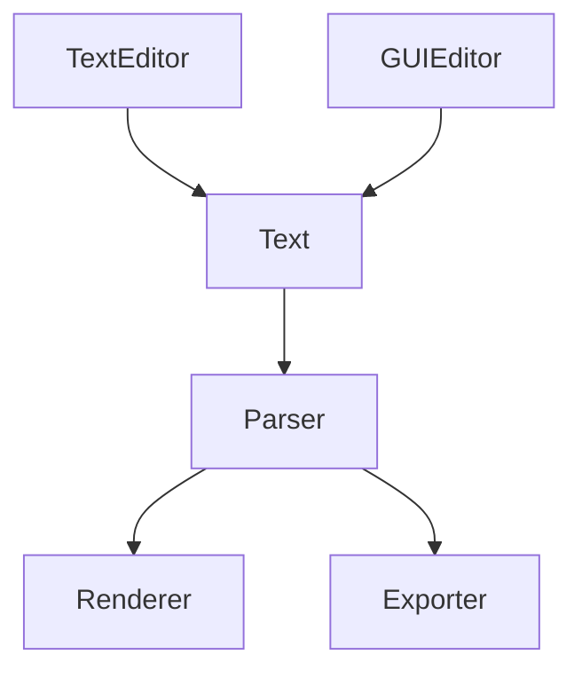

# Todo / estimator / task list

Back in college I made a simple todo list program that would burn the list onto the desktop background image. It was neat, because any time I locked my screen or minimized my apps, I would be reminded of my tasks. It sat in the task tray so you could update it, and it in turn would update your desktop.

The first version used a tree control with columns and checkboxes and a button bar with rich controls. It looked like a serious program and people thought it was cool. But after using it for a while, I realized that it was kind of awkward to work in. Just like spreadsheets or MS Project, moving things around needed me to click on buttons, add multi-select, add drag-n-drop, the list goes on. Basically complexity was exploding. And I had this whole XML file to save the data in. _There had to be a better way._

The second version ditched all of that and just had a text editor. Indenting lines gave it hierarchy, a leading tilde (`~`) character struck out the line, I saved it to a simple text file. My user experience was so much better!! I could use copy+paste and all the other features I was used to in an editor. I could use whatever text editor I wanted if I didn't like my tool. _And the code was so much simpler._

People didn't think the second version looked as cool, but for me it worked so much better. That was over 20 years ago, around the time that markdown was invented. Today, there seems to be a lot more interest in simple things that are effective.

This version is a spiritual successor and an exploration of what Claude is capable of. It seems pretty capable, but weird and verbose in its language and I wouldn't trust it to write this readme, for example. The kind of thing it writes is [plan-format-spec](plan-format-spec.md).

## The file format

The file is intended to be simple. An optional markdown-style preamble section that allows you to define some properties, then the same indentation-based todo list. Pipe (`|`) separated values for multi-column data.

```
---
columns: est:duration | owner:text | notes:text
---
// Q4 auth work. Estimates are rough.
Auth                        | 2d
    ~Login page             | 4h  | alice
    Password reset          | 6h  | alice
    OAuth (Google)          | +1d |       | may not need for v1
        Consent screen      | 2h
        Token refresh       | 3h
Admin                       |     | bob
    User list               | 1d
    // Audit log            | 2d     <- dropped for now
```

I considered actual markdown, but decided against it because having to put `- [ ]` before every line would be annoying.

I also considered YAML but even putting `-` on every line would be annoying. With a structured format like YAML there were several choices for handling multiple columns, but none seemed elegant.

## Architecture

The basic idea is that text is easily read/written. A GUI can still be made for those people that prefer lots of buttons, it just needs to translate actions into text updates. From the text a parser generates a datastructure and a renderer or exporter then transforms that into something useful.



It should be fairly trivial to process these text files with other utilities, assuming we can all agree on what goes in the frontmatter.

A renderer might make it look like a spreadsheet or a gantt chart or whatever you enjoy best.

## Features

### What's in today

- syntax highlighting and feedback (info, warning, errors)
- simple renderer examples
- loading/saving files
- simple column roll-up rules (for duration)

### What's planned tomorrow

- simultaneous multi-user editing
- include files, for such as for multi-project rollups
- gantt chart and project features, like critical path
- additional decorators to make milestones etc.
- a "spreadsheet-like GUI input" for non-text people
- export to more file formats - html, MS Office, pdf, MS Project, etc.
- a CLI tool for converting from/to files
- extracting the common core to a library
- more column types, named column support
- a vscode extension
- general quality of life, such as themes
- and once there's enough feedback, documenting and versioning the file format

## Acknowledgements and Attributions

Used `code mirror 6` and `lezer` for this version, both very cool. Claude code for being very interesting, although you have to really watch what it does.
